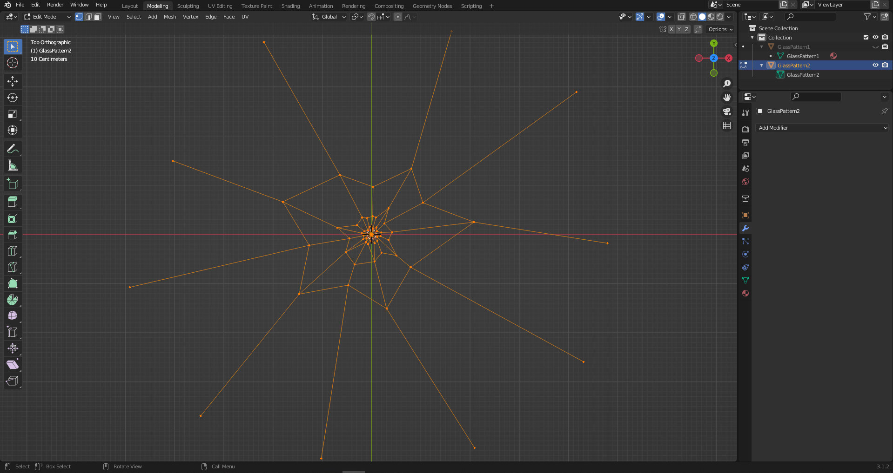
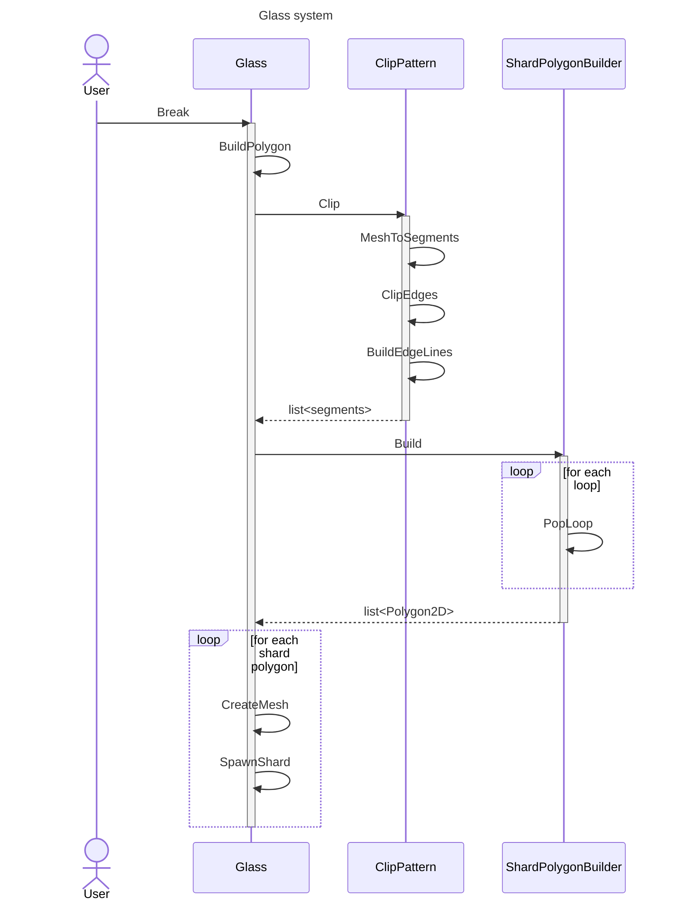
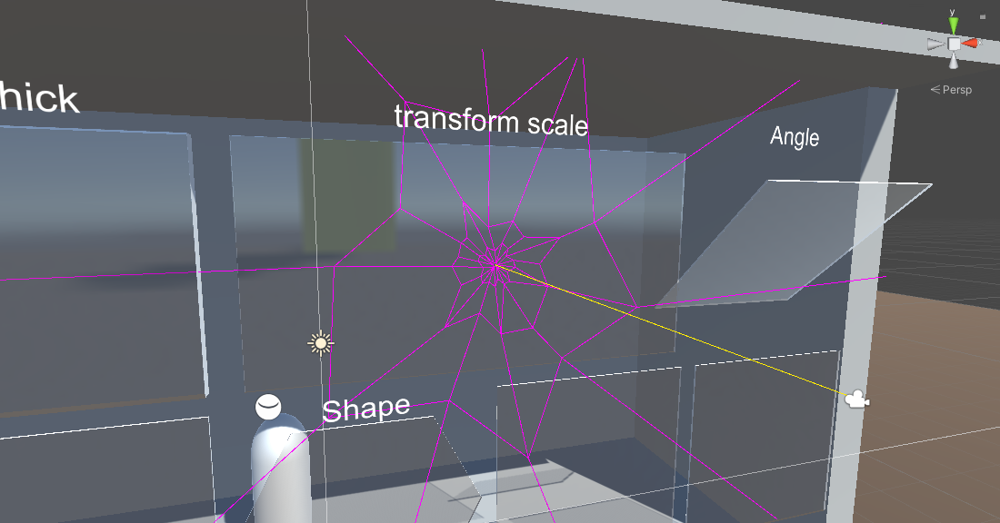
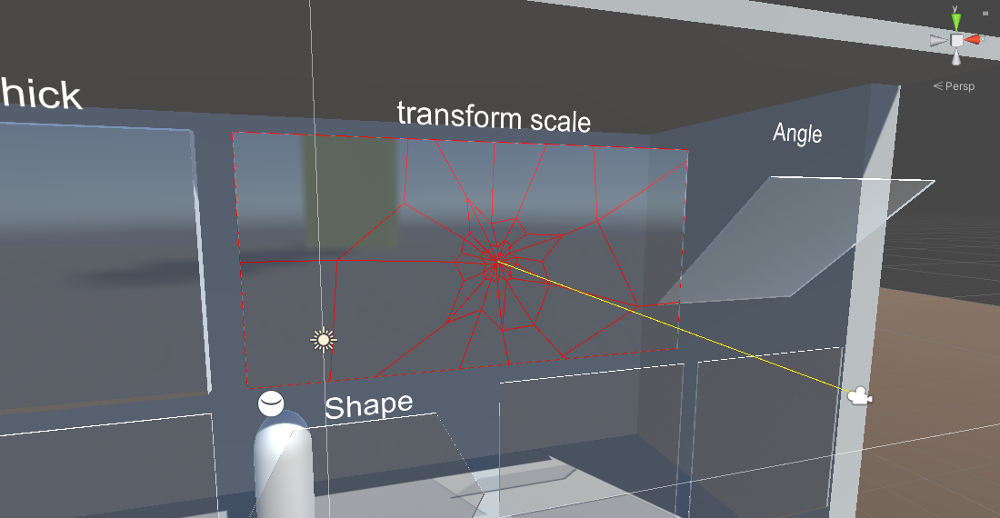
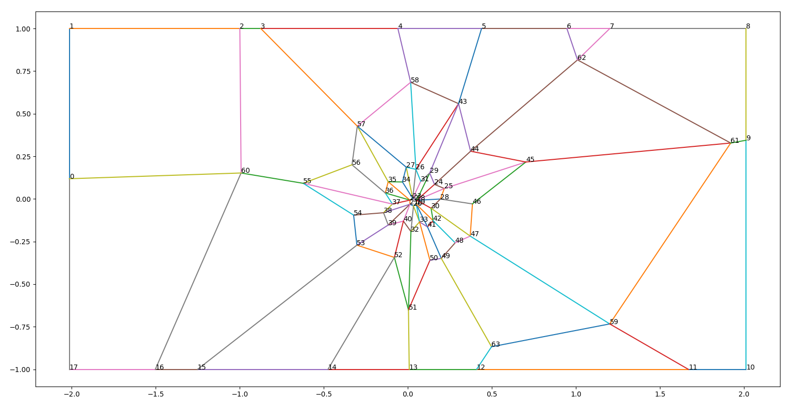
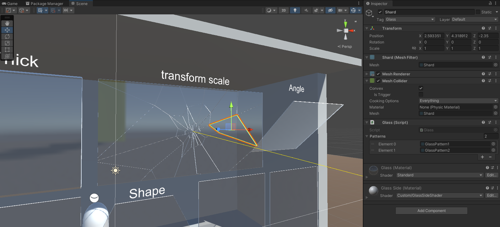

# Window Fracture Technical Documentation

This document explains how the package works internally and how the fracture pipeline is implemented.

## Scope

- This is an implementation-oriented document for developers extending or debugging the package.
- User setup and entry-level usage are documented in `../README.md`.

## High-Level Architecture

The runtime is built around a deterministic fracture pipeline:

1. Convert the target glass mesh into a 2D polygon representation.
2. Project a fracture pattern on that polygon at impact position and rotation.
3. Clip projected segments against panel boundaries.
4. Convert clipped segments into closed shard polygons.
5. Extrude each shard polygon into a mesh.
6. Spawn shard GameObjects and apply physics/anchoring behavior.

Core runtime classes:

- `WindowFracture.Runtime.BaseGlass`
  - Shared fracture flow and shard mesh spawning.
- `WindowFracture.Runtime.GlassPanel`
  - Root panel implementation, polygon extraction, and connectivity/anchor logic.
- `WindowFracture.Runtime.Shard`
  - Child fragment type for recursive breaking and panel callbacks.
- `WindowFracture.Runtime.ClipPattern`
  - Pattern projection, segment clipping, and edge reconstruction.
- `WindowFracture.Runtime.ShardPolygonBuilder`
  - Segment graph traversal and loop-to-polygon conversion.
- `WindowFracture.Runtime.MathNetUtils`
  - Utility math for sorting, interpolation, and indexed points.

## Inputs And Assets

Required runtime inputs:

- A mesh object with `MeshFilter`, `MeshRenderer`, and `Collider`.
- A `GlassPanel` or derived `BaseGlass` component.
- One or more fracture pattern meshes in `BaseGlass.Patterns`.
- Materials configured on the source renderer (reused for shard renderers).

Asset roles:

- `Runtime/Resources`
  - Pattern meshes and default material/shader resources.
- `Runtime/Prefabs/glass.prefab`
  - Example configured object.
- `Runtime/Plugins/MathNet`
  - MathNet dependencies used by clipping and geometric operations.

Pattern authoring reference:

## End-To-End Sequence

## Detailed Pipeline

### 1. Impact normalization and polygon extraction

Entry point: `BaseGlass.Break(Vector3 breakPosition, Vector3 originVector, int patternIndex = -1, float rotation = float.NaN)`

Key operations:

- Transform world impact into local object space.
- Multiply X/Y by lossy scale to keep geometric operations in scaled local coordinates.
- Call `BuildPolygon(localPosition.z)` once and cache it in `_polygon`.

`GlassPanel.BuildPolygon(...)` implementation details:

- Reads source mesh vertices from `MeshFilter.sharedMesh`.
- Rejects unsupported geometry sizes (`< 3` or `> 100` vertices).
- Calculates `_thickness` from mesh Z extents and object Z scale.
- Keeps only front-face points near impact side (`Tolerance` check).
- Removes duplicate side vertices.
- Sorts points clockwise and constructs panel `Polygon2D`.
- Captures original UV mapping to `_uvs`.
- Stores `_frameBoundaryEdges` for later anchor detection.

### 2. Pattern projection

`ClipPattern.MeshToSegments(...)`:

- Reads line topology from pattern mesh indices.
- Rotates segments by selected angle.
- Translates segments to impact offset.

Determinism controls:

- `patternIndex = -1` picks a random pattern.
- `rotation = NaN` picks a random rotation.
- Passing both values explicitly makes fracture deterministic across clients/replays.

Projection reference:

### 3. Pattern clipping against panel boundary

`ClipPattern.ClipEdges(...)`:

- Segment fully inside polygon: kept unchanged.
- Segment fully outside polygon: discarded.
- Segment crossing polygon: trimmed at intersection point.

`ClipPattern.BuildEdgeLines(...)`:

- Merges original panel vertices and computed intersection points.
- Sorts by vector angle.
- Reconstructs boundary edge segments used for shard extraction.

Clipping reference:

### 4. Shard polygon computation from segment graph

`ShardPolygonBuilder.Build(...)` algorithm:

- Assign index to each unique point with tolerance-based matching.
- Build adjacency list for undirected segment graph.
- Sort adjacency clockwise for each node.
- Copy adjacency into a consumable structure.
- Remove the outer loop.
- Repeatedly call `PopLoop(...)` until graph is consumed.
- Convert loops to convex shard polygons.

Geometry layout reference:

### 5. Mesh generation and shard spawning

`BaseGlass.CreateMesh(...)`:

- Triangulates front face.
- Triangulates back face with `-thickness` Z offset.
- Generates side quads linking front/back contours.
- Writes two submeshes:
  - submesh `0`: side faces
  - submesh `1`: front and back faces
- Recalculates normals and bounds.

UV handling:

- If `_uvs` exists, each shard vertex UV is interpolated using barycentric coordinates.
- Current implementation uses the first polygon triangle as interpolation reference.

`BaseGlass.SpawnShard(...)`:

- Creates shard object with mesh filter, renderer, and convex mesh collider.
- Applies source tag, rotation, and shared materials.
- Chooses behavior by estimated shard surface:
  - large shard: add `Shard` component for recursive breaking.
  - small shard: add rigidbody, apply force, auto-destroy after timeout.

Mesh generation reference:

## Physics, Anchoring, and Connectivity

`GlassPanel` builds a shard neighbor graph:

- Nodes are `Shard` instances.
- Edges connect shards that share an edge in panel space.
- `_anchoredShards` marks shards touching frame boundary edges.

On shard destruction:

- Remove shard from graph.
- Run BFS from anchored shards.
- Any non-reachable shard is considered disconnected and is dropped with `Fall()`.

This creates cascading break behavior where unsupported islands detach naturally.

## Runtime Constraints And Failure Modes

Expected constraints:

- Best results on flat, window-like meshes.
- Polygon extraction assumes manageable vertex count.
- Materials should support both face and side rendering setup used by your content.

Known failure points:

- Missing `MeshFilter` or invalid mesh topology prevents polygon construction.
- Empty `Patterns` array causes pattern selection failure.
- Extremely noisy UV layouts can produce visible interpolation artifacts.
- Graph anomalies can trigger `InternalGlassException` safeguards.

## Debugging Guidelines

- Validate panel mesh and collider first.
- Test with deterministic `patternIndex` + `rotation` when reproducing bugs.
- Inspect generated shard count and adjacency behavior under repeated impacts.
- Use sample scene in `Samples~/Glass Demo` for baseline comparison.
